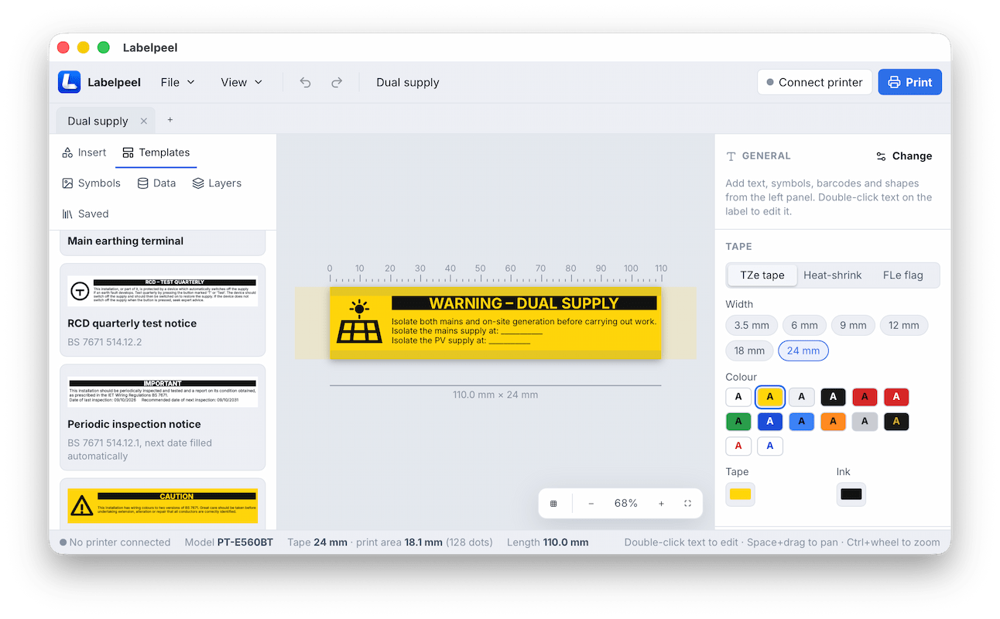
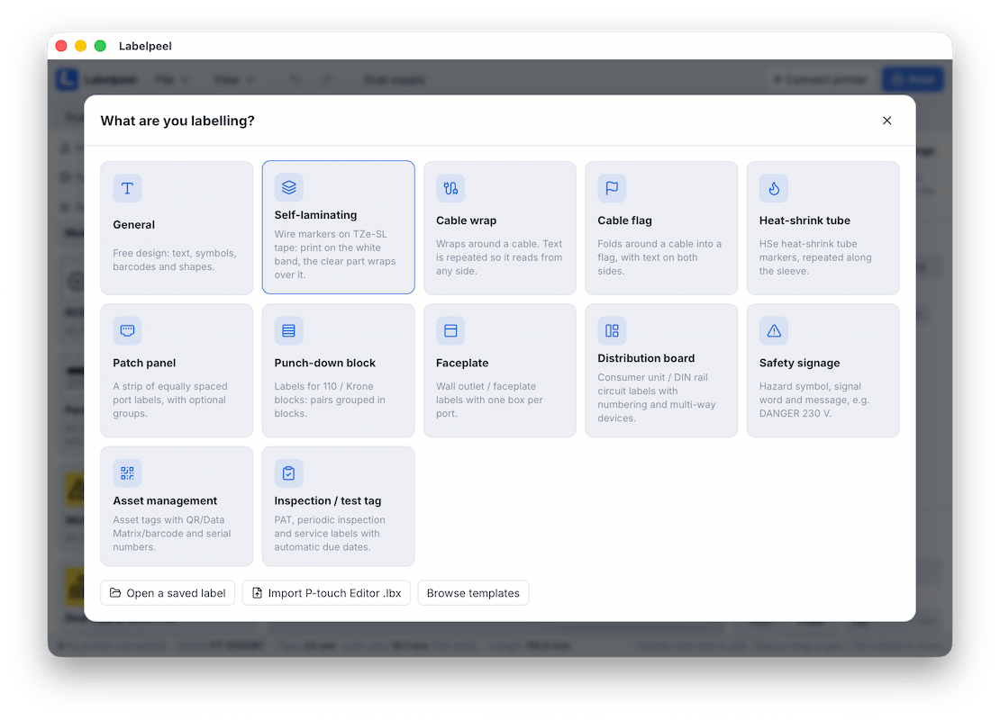

<p align="center"></p>

# Labelpeel

A label designer for Brother P-touch printers that prints directly over Bluetooth or USB, in the browser or as an app for Mac and Android. It was built first for the **PT-E560BT** and has profiles for the rest of the PT range.



## Get Labelpeel

| | | |
| --- | --- | --- |
| **Web** | [Open Labelpeel](https://lookleft.github.io/labelpeel/) | Nothing to install. Prints from Chrome or Edge on Windows, Linux and ChromeOS, over Bluetooth or USB. Works offline once loaded, and can be installed as an app from the address bar. |
| **Mac** | [Download Labelpeel.dmg](https://github.com/LookLeft/labelpeel/releases/latest/download/Labelpeel.dmg) | Recommended on a Mac. Connects to the paired printer directly over Bluetooth or USB, shows labels at real size and updates itself. macOS 13 or later. |
| **Android** | [Download Labelpeel.apk](https://github.com/LookLeft/labelpeel/releases/latest/download/Labelpeel.apk) | Prints over Bluetooth and USB; Chrome on Android can only use USB. Open the file on your phone to install it. |
| **iPhone and iPad** | [Build it yourself](ios/README.md) | Browsers on iOS can't reach printers. The app isn't on the App Store, but you can install it on your own devices from Xcode. |

All versions and release notes are on the [releases page](https://github.com/LookLeft/labelpeel/releases/latest). Your labels are saved on your device: see [where your labels are stored](#where-your-labels-are-stored).

> Labelpeel is an independent project. It is not affiliated with, endorsed by or sponsored by Brother Industries, Ltd. Brother, P-touch, TZe, HSe and FLe are trademarks of Brother Industries, Ltd.; they and printer model names are used here only to describe compatibility.

## Features



- **Start from what you're labelling.** Choose a label type and the layout is generated from a few settings:
  - general text, self-laminating, cable wrap, cable flag, heat-shrink
  - patch panel, punch-down block, faceplate
  - distribution board, safety sign, asset tag, inspection or test label
- **Distribution boards.** Set the module pitch and how many ways each block takes (for example, a 2-way RCD). You also control:
  - circuit numbers and heavy group dividers
  - horizontal or vertical text, and where the text sits
  - presets for UK 10-way and 20-way consumer units, three-phase, DIN and mixed boards
- **About 50 templates**, grouped into:
  - Electrical (BS 7671 warnings, isolation, RCD test, periodic inspection, dual supply)
  - Distribution boards
  - Safety
  - Network & cables
  - Asset & inspection
  - Office & home
- **Clip art.** Hand-drawn ISO 7010–style warning, prohibition, mandatory and safe-condition signs, plus IEC electrical symbols. Around 1,900 more black and white icons, searchable and grouped by category.
- **Editor.** A canvas you can zoom and pan, with:
  - snapping, multi-select, resize and rotate, align and distribute, layers
  - undo and redo
  - inline text editing with bold, italic and underline, and auto-fit text
  - bundled fonts, a font file you load, or your installed fonts (Chrome and Edge on desktop)
  - pinch to zoom on touch screens and trackpads
- **Tables.** Rows and columns with merged cells, black, hatched or dotted cell fills, and solid, dashed or dotted lines. Double-click a cell to edit it.
- **Frames.** Around the whole label or any part of it: rectangle, rounded, double, thick, dashed, dotted, hazard stripes, brackets, corner marks, cut corners, ticket and tag.
- **Codes.** QR, Data Matrix, Code 128, Code 39, EAN, UPC and others. Modules snap to printer dots so codes scan reliably.
- **Data.** Placeholders such as:
  - `{{date}}`, `{{date+12m}}` and `{{date+1y:MMM YYYY}}`
  - `{{time}}`
  - serial numbers `{{n}}`, with a start, step, zero padding, and numbers or letters
  - any column from a CSV or pasted spreadsheet
  
  Printing produces one label per record or serial number.
- **Tape and cutting.**
  - 3.5–36 mm TZe, HSe heat-shrink and FLe flag media, and self-laminating tape with its clear part shown
  - auto or fixed length, margins, tape and ink colours
  - cut after each label or every few labels, at the end, or never; half cut; chain printing; mirror
  - copies, and splitting a long design into several labels
- **Preview.** A dot-accurate preview shows exactly what the print head will print, on the full width of the tape, laid out as the strip that comes out of the printer with its cuts marked. Anything outside the printable area is shown in red with a warning. You can also export a PNG or a raw `.bin` print file.
- **Tabs.** Work on several labels at once, each with its own undo history and zoom. Double-click a tab to rename it. Print all open labels as one job to save tape.
- **Files.** Save, Save As and Open use `.labelpeel` (JSON) files, with a local library of saved labels, and open tabs are restored when you come back. **File → Back up everything** saves all of it to one file.
- **Brother `.lbx` import** (see below).

## Printing

In a browser, printing needs Chrome or Edge on desktop, ChromeOS or Android. Firefox and Safari can design labels but can't reach printers; on a Mac, iPhone or iPad, use the [native apps](#mac-app) instead.

| Connection | How |
| --- | --- |
| Bluetooth | Pair the printer in your OS settings, then choose **Connect printer → Bluetooth**. This uses Web Serial over Bluetooth Classic RFCOMM and needs Chrome 117 or later. On Windows you can also choose the printer's outgoing COM port. On macOS, pick the port starting with `cu.` (for example `cu.PT-E560BT…`): Chrome's direct Bluetooth link fails to open there. The printer showing "Not Connected" in macOS after pairing is normal. |
| USB | Uses WebUSB. Works on macOS, Linux, ChromeOS and Android. On Windows, Brother's driver holds the device, so use Bluetooth there. On Linux, you may need a udev rule giving access to vendor `04f9`. |

Over USB the printer reports the tape that is loaded. The app offers to switch your design to match it, and stops a design for wider tape from printing (with an override), since its edges would be lost.

A serial port can open with no printer behind it (macOS keeps a paired printer's `cu.` port even when it's off), so the app only treats the printer as connected once it replies, and shows "Printer not responding" until then.

If labels don't print, turn on **Printer → Advanced → Minimal command set**. This sends exactly the byte sequence [ptouch-print](https://git.familie-radermacher.ch/linux/ptouch-print.git) uses, which has been verified on the PT-E560BT. In that mode the printer uses its own cut defaults.

The cut, half-cut and chain commands follow Brother's raster command reference but haven't been tested on hardware yet.

## Where your labels are stored

Open tabs, **My labels** (File → Save to My labels) and settings are kept in the browser's storage for the site, or the app's own storage:

| | Location | Updates | Uninstalling |
| --- | --- | --- | --- |
| Website | The browser's storage for the site | Kept | Lost if you clear the site's data; Safari also clears sites you haven't used for 7 days |
| Mac app | `~/Library/WebKit/com.lookleft.labelpeel.mac/WebsiteData` | Kept | Kept if you only move the app to the Bin; deleting that folder removes it |
| iPhone / iPad app | The app's container | Kept | Deleted with the app |
| Android app | The app's data | Kept | Deleted with the app (and if you clear the app's storage) |

The app asks the browser to keep its storage permanently, but browser storage is never a guaranteed archive. Save labels you care about as `.labelpeel` files, or use **File → Back up everything**, which saves open labels, My labels and settings in one `.json` file. **File → Restore from backup** brings them back on any device, without overwriting newer copies.

## Brother's own file format (.lbx)

P-touch Editor saves `.lbx` files: a ZIP archive with `label.xml` (the layout, in Brother's undocumented XML schema), `prop.xml` and any embedded images. Labelpeel both reads and writes them, matched against files saved by P-touch Editor. `test/lbx.test.ts` checks the same structures with small generated files; put real P-touch Editor files in `examples/` (not committed) to also test against those.

**File → Import P-touch Editor .lbx** brings in:

- tape width, length (fixed or auto), margins, orientation and colours
- text with its font, size, bold, italic, underline, alignment, line spacing, vertical text, the outline effect and shrink-to-fit
- rectangles and rounded rectangles (outlined or filled), groups
- tables, with cell text, merges, per-cell bold and alignment
- barcodes (Code 128, QR, Data Matrix, EAN, UPC and others)
- images, cropped as in P-touch Editor

Brother's fonts are mapped to the closest bundled font (Helsinki to Inter, Helsinki Narrow and Utah Condensed to Roboto Condensed, and so on). Anything it can't map is listed after import, for example mixed styles within one text box, justified text, or P-touch Editor's decorative frames (imported as plain frames).

**File → Export for P-touch Editor (.lbx)** writes text, rectangles, plain tables and Code 128 barcodes as normal P-touch Editor objects, so they stay editable there. Everything else (symbols, other shapes and frames, QR and other codes, blocks, filled table cells, white-on-black or rotated text, the label frame) is written as an image of exactly what Labelpeel prints, and smart fields are written as their current values. A message after export lists anything written this way.

## Mac app

Browsers on a Mac can only reach a Bluetooth printer through the serial port
macOS keeps for every paired device, which opens even when the printer is off.
`macos/` has a small native app that wraps this one and connects to the paired
printer directly over Bluetooth or USB. Each release includes a signed,
notarized `.dmg` ([download the latest](https://github.com/LookLeft/labelpeel/releases/latest/download/Labelpeel.dmg)), and the
app updates itself from new GitHub releases. See [macos/README.md](macos/README.md).

## Android

Chrome on Android can use the web app over USB. `android/` has a small native
app that wraps this one and prints over Bluetooth or USB. Each release includes
an installable APK ([download the latest](https://github.com/LookLeft/labelpeel/releases/latest/download/Labelpeel.apk)). See
[android/README.md](android/README.md).

## iPhone and iPad

Browsers on iOS can't reach printers, so `ios/` has a small native app that
wraps this one and adds a Bluetooth bridge. It's for installing on your own
devices from Xcode: publishing it on the App Store would need Brother's MFi
approval. See [ios/README.md](ios/README.md).

## Development

```sh
npm install
npm run dev        # http://localhost:5173
npm test           # unit tests: protocol, status packets, cuts, tables, placeholders
npm run build      # type-check and build to dist/
```

`npm run dev` and `npm run build` also collect the bundled packages' licences into `public/licenses.txt`. After changing `assets/icon.png`, run `python3 scripts/icons.py` to regenerate the web, iOS, Mac and Android icons.

The stack is Vite, React, TypeScript and zustand. bwip-js renders barcodes and Lucide supplies the icons.

Main folders:

- `src/printer`: printer protocol, profiles, transports, status parsing and the native app bridge
- `src/render`: renders a design to the canvas and to the 1-bit print bitmap
- `src/model`: label types, templates, tables and placeholders
- `ios/`, `macos/`, `android/`: the native apps, each built from `dist/` by its `build-web.sh`
- `scripts/`: licence collection, icon generation and macOS signing setup

## Deploying and releases

- **Website:** a static site. `.github/workflows/deploy.yml` builds and tests every push and pull request, and deploys pushes to `main` to GitHub Pages. To turn this on once, go to **Settings → Pages → Build and deployment → Source** and choose **GitHub Actions**.
- **Native apps:** `android.yml` and `macos.yml` build the Android and Mac apps on every push and pull request; the APK is attached to each run.
- **Releases:** run **Actions → Release → Run workflow** with a version such as `0.1.0`, or push a tag like `v0.1.0`. It builds the signed Android APK and the signed, notarized Mac `.dmg`, and publishes a GitHub release with both attached. Signing needs repository secrets, set up once as described in [android/README.md](android/README.md#releases-and-signing) and [macos/README.md](macos/README.md#releases-signing-and-notarization). Each release also carries `appcast.xml`, the Mac app's update feed. The files have fixed names (`Labelpeel.dmg`, `Labelpeel.apk`), so the download links above always get the newest release.

## Credits

The protocol details come from [ptouch-print](https://git.familie-radermacher.ch/linux/ptouch-print.git), [ptouch-rs](https://github.com/vowstar/ptouch-rs), [ptouch-webapp](https://github.com/the78mole/ptouch-webapp) and Brother's raster command reference. No code from those projects is included; they were used as references for the printer's command protocol. Brother's `.lbx` format is read only so you can import your own files.

Brother, P-touch, TZe, HSe and FLe are trademarks of Brother Industries, Ltd. Labelpeel is not affiliated with Brother.

Third-party open-source licences for everything bundled in the app are collected into `licenses.txt` at build time (`scripts/licenses.mjs`) and shown under **View → About Labelpeel**.
